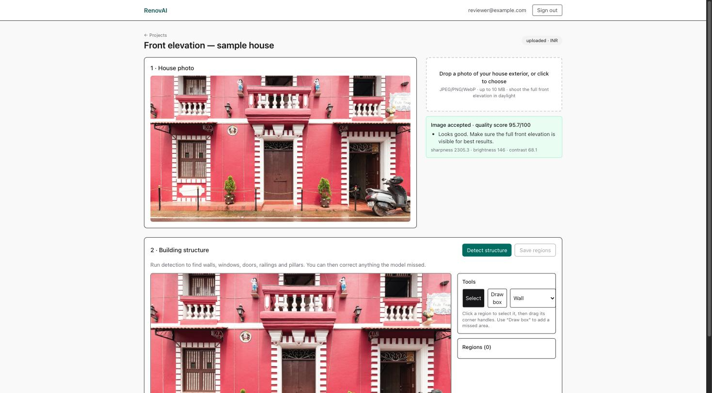
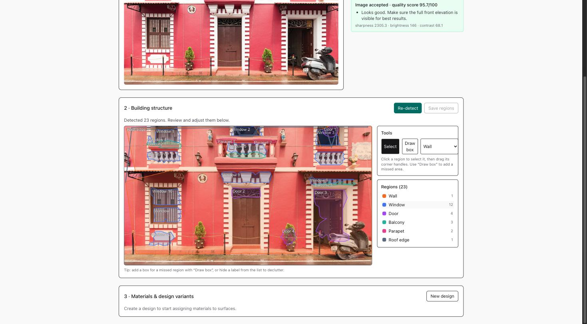
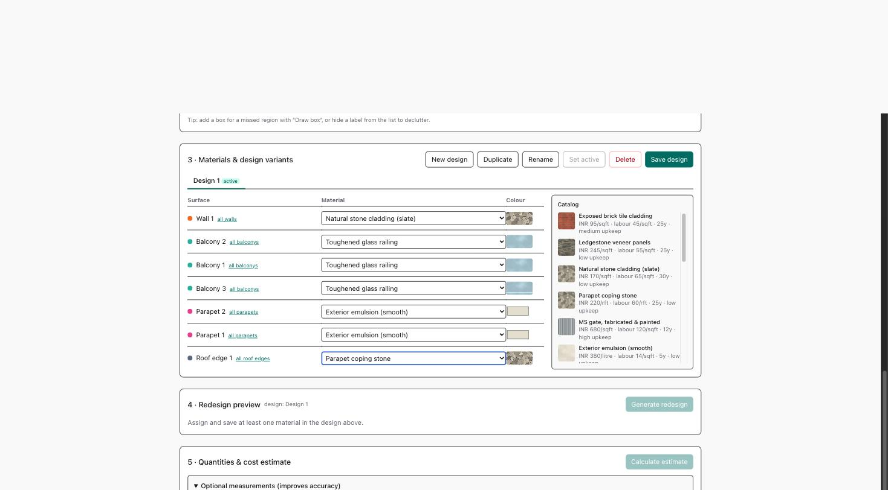
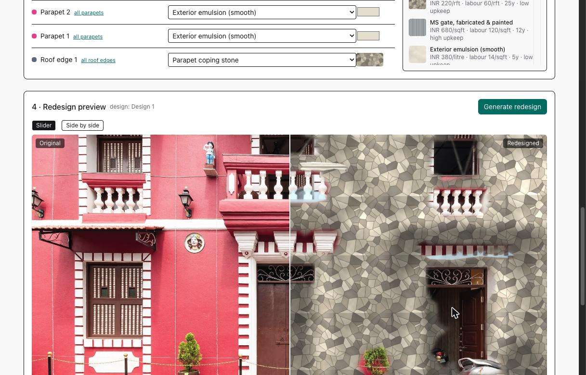
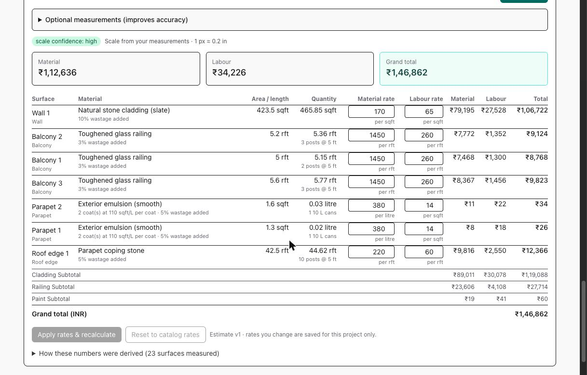
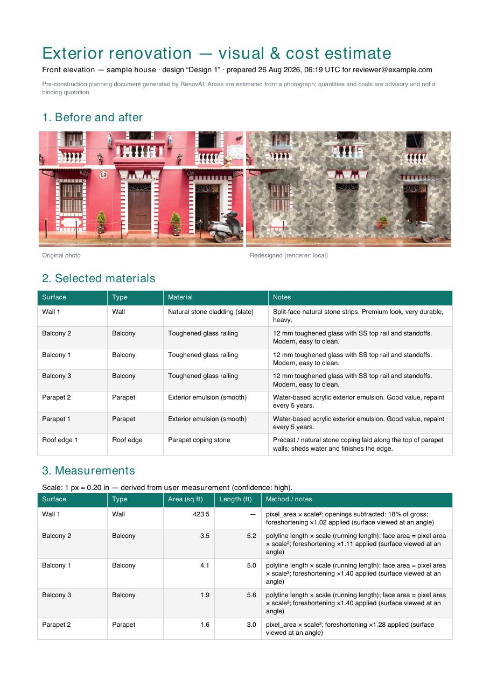

# AI-Based Exterior House Renovation & Cost Estimation

Upload a photo of a house exterior, let the system map its surfaces (walls, windows, pillars,
balconies, parapets…), assign materials from a catalog to each surface, see the house redesigned,
and get a transparent material-quantity and cost estimate you can download as a PDF and take to a
contractor.

Built as a 24-hour prototype for the E2M Solutions AI Engineer practical assessment. The whole
stack runs locally with **zero API keys**; hosted AI providers are optional upgrades.

> **For reviewers — please run it locally (one command, ~5 minutes).**
> There is intentionally no public demo URL: the backend needs S3-compatible object storage, and
> every free-tier provider (Cloudflare R2, AWS) requires a payment method I chose not to attach for
> an assessment. The Docker Compose stack below is the reviewed artifact — it is what CI builds,
> boots and smoke-tests on every push. A cloud layout (Vercel + Hugging Face Space + Neon + R2) is
> fully prepared in [docs/deployment.md](docs/deployment.md) and needs only credentials.

| Doc | What it covers |
|---|---|
| [docs/architecture.md](docs/architecture.md) | Components, data flow, job queue, render provider chain |
| [docs/user-workflow.md](docs/user-workflow.md) | The six-step homeowner flow, screen by screen |
| [docs/estimation.md](docs/estimation.md) | How scale, areas, quantities and costs are derived — every formula and assumption |
| [docs/limitations.md](docs/limitations.md) | What the prototype does not do, and where the numbers are weakest |
| [docs/deployment.md](docs/deployment.md) | Docker Compose locally; Vercel + Hugging Face Space + Neon + R2 for the cloud |
| [docs/plans/](docs/plans/README.md) | Phase-by-phase build log, review findings and fixes |

## What it looks like

| | |
|---|---|
|  **1 · Upload** — sharpness/brightness/contrast checked, guidance shown |  **2 · Structure** — 23 regions detected on the sample photo, editable on the canvas |
|  **3 · Materials** — per-surface catalog filtered by what applies, design variants |  **4 · Visualize** — before/after slider, openings preserved (local compositor, no API keys) |
|  **5 · Estimate** — areas, quantities to buy, editable rates, category subtotals |  **6 · Report** — downloadable PDF with images, materials, measurements, costs, assumptions |

## Quick start (Docker, ~5 min)

Requirements: Docker Desktop (or Docker Engine + Compose v2), 4 GB free RAM.

```sh
git clone https://github.com/vishal-jadeja/ai-exterior-house-renovation.git
cd ai-exterior-house-renovation
make up            # copies .env.example → .env if missing, builds and starts everything
```

Then open <http://localhost:3000>, register with any email/password, create a project and upload
`samples/house-1.jpg`. The API is at <http://localhost:8000> (`/docs` for OpenAPI), MinIO console
at <http://localhost:9001> (`minioadmin` / `minioadmin`).

The first "Detect structure" downloads the segmentation model (~15 MB SegFormer) into the `models`
volume, so it takes a minute; subsequent runs take a few seconds.

`make logs` tails api/worker/web; `make down` stops the stack.

## Local development (without Docker for app code)

```sh
make infra                                   # postgres + minio only
cd apps/api && python -m venv .venv && source .venv/bin/activate
pip install -e ".[dev,ml,report]"
make migrate && make seed
make api                                     # http://localhost:8000, --reload
make worker                                  # in a second terminal
cd apps/web && pnpm install && pnpm dev      # http://localhost:3000
```

Checks: `make lint typecheck test` (ruff, mypy, pytest; eslint, tsc). CI runs the same plus a
full `docker compose build && up` smoke test.

## Demo script (what a reviewer should try)

1. **Upload** `samples/house-1.jpg`. Try `samples/house-2.jpg` blurred or a 300 px thumbnail to
   see the quality gate reject it with guidance.
2. **Detect structure** — regions appear on the photo. Drag a vertex, relabel a region, draw a
   missing balcony, delete a false positive, save.
3. **Design** — assign "Natural stone cladding" to one wall, "Premium emulsion" to the rest via
   *all walls*, a glass railing to the balcony. Duplicate the design and swap the cladding for
   brick to compare two options.
4. **Render** — generate; drag the before/after slider. With no API keys the local compositor is
   used (texture + colour mapped onto each region, openings preserved). Set `FAL_KEY` or
   Cloudflare credentials in `.env` for diffusion-based renders.
5. **Estimate** — enter the facade width if you know it (confidence goes to *high*); otherwise
   read the assumption chain. Edit a rate, recalculate, see the stale banner logic.
6. **Report** — download the PDF: photo, render, materials, quantity derivation, cost table,
   assumptions.

## Repository layout

```
apps/api        FastAPI + SQLAlchemy (async) + Alembic; worker.py runs the job queue
apps/web        Next.js 16 (app router), react-konva region editor
infra           Dockerfiles + docker-compose.yml
seed            materials.json catalog + texture swatches (seeded on every API boot)
samples         two facade photos for demos/tests (see ATTRIBUTION.md)
docs            deliverable documentation; docs/plans is the build log
```

## Configuration

Everything is read from the environment (`.env` at the repo root; see `.env.example` for every
key with comments). Notable:

| Key | Purpose |
|---|---|
| `SEGMENTATION_MODEL` | HF SegFormer checkpoint; `SEGMENTATION_ENABLED=false` skips it (draw regions by hand) |
| `GEMINI_API_KEY` | Optional: Gemini refines/relabels detected regions and adds missed ones |
| `FAL_KEY`, `CF_ACCOUNT_ID`+`CF_API_TOKEN` | Optional diffusion inpainting renderers; `RENDER_PROVIDER_ORDER` sets the fallback order, local compositor is always last |
| `MAX_UPLOAD_BYTES`, `MIN_IMAGE_DIMENSION` | Upload limits enforced server-side |
| `APP_ENV=prod` | Enables the production guard (real JWT secret, secure cookies, non-default S3 keys, no localhost CORS) |

## Status

All eight functional areas of the brief (upload + quality gate, structure identification with
review/edit, catalog + multi-design assignment, visualization with comparison, area estimation,
quantity calculation, editable-rate costing, PDF report) are implemented and tested. See
[docs/limitations.md](docs/limitations.md) before trusting a number.
