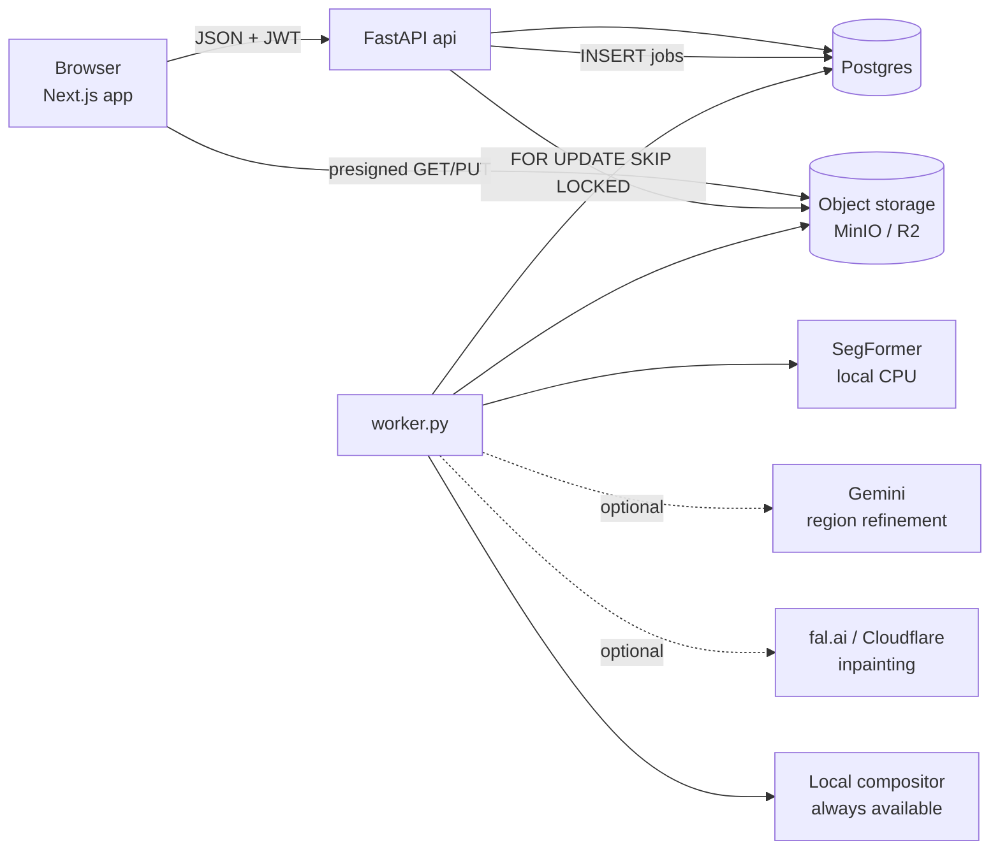

# Architecture

## Components

| Component | Tech | Responsibility |
|---|---|---|
| `apps/web` | Next.js 16, React 19, Tailwind, react-konva, zustand | Six-step wizard; region editor on a canvas; before/after slider; polling of async jobs |
| `apps/api` | FastAPI, SQLAlchemy 2 async, Alembic, pydantic-settings | Auth, projects, uploads + quality gate, regions, designs, estimates, rate cards; enqueues jobs |
| `apps/api/app/worker.py` | same codebase, separate process | Claims jobs from Postgres, runs segmentation / render / report handlers |
| Postgres | 16 | All state; also the job queue (no Redis/broker) |
| MinIO / Cloudflare R2 | S3 API | Sanitized photos, texture swatches, renders, PDFs; browser reads via presigned URLs |

One Docker image serves both `api` and `worker` (different `command`).

## Request → job → result

Long operations never run inside a request. `POST /projects/{id}/segment`,
`POST /designs/{id}/render`, `POST /designs/{id}/report` insert a `jobs` row and return `202`
with a `job_id`; the web app polls `GET /jobs/{id}` (`lib/jobs.ts`, 10-minute deadline, abortable)
and reloads the resource when it reaches `done`/`failed`.

The worker claims with
`UPDATE jobs SET status='running' WHERE id = (SELECT id … FOR UPDATE SKIP LOCKED LIMIT 1)`,
so N worker replicas can run safely. Failures are retried up to `JOB_MAX_ATTEMPTS` with
exponential backoff (implemented by pushing `created_at` forward); jobs stuck `running` for 15
minutes are reclaimed. Idempotency keys (`segment:{image_id}`, `render:{render_id}`) make
double-clicks return the existing job.

## Pipelines

### Upload (`routers/images.py`, `services/images.py`, `services/quality_gate.py`)
Content-Length + chunked read cap → magic-byte sniff → EXIF transpose + metadata strip →
decompression-bomb guard → clamp to 4096 px → quality gate (Laplacian sharpness, brightness,
contrast, min side) → store as JPEG under a unique key → previous photo marked `superseded` and its
regions deactivated (never deleted, so design assignments survive).

### Structure identification (`jobs.segment_job`, `services/segmentation.py`, `region_mapper.py`)
SegFormer fine-tuned on CMP Facade (`facade, window, door, balcony, pillar, cornice, …`) →
argmax/confidence maps upsampled to the working resolution → connected components per class,
small blobs dropped (`MIN_AREA_FRAC`), polygons simplified → taxonomy mapping to our labels
(`wall, window, door, balcony, pillar, parapet, railing, gate, roof_edge`) → `parapet` and
`roof_edge` derived geometrically from the wall silhouette → optional Gemini pass that relabels,
drops or adds regions from the photo → regions stored with `source` (`model` / `gemini` / `user`),
`confidence`, `version`. Users edit via `PUT /projects/{id}/regions` (bulk replace with soft
deactivation of removed regions).

### Design (`routers/designs.py`)
Up to 10 named designs per project; each is a `region_id → material_id (+ colour)` map validated
against `applicable_labels` in the catalog. Clone / activate / rename.

### Render (`jobs.render_job`, `providers/render/*`)
`FallbackChainRenderer` walks `RENDER_PROVIDER_ORDER` (default `fal, cloudflare, local`), skipping
providers that are not configured and falling through on errors. Diffusion providers get a mask
with per-region holes cut for openings; the local compositor tiles the material swatch (or paints a
colour) into each region mask, transfers the original luminance so shading survives, and leaves
windows/doors untouched. The provider actually used and the fallback log are stored on the render.

### Estimate (`routers/estimates.py`, `services/{scale,area}_estimator.py`, `quantity_engine.py`, `cost_engine.py`)
Pure functions over region polygons, user measurements, catalog properties and rates. Every
stored estimate carries a fingerprint of its inputs (measurements, currency, source image, region
polygons, assignments, rates, material properties); `GET …/estimate` reports `stale: true` when
anything changed, and `POST …/report` refuses to print a stale estimate. Details in
[estimation.md](estimation.md).

### Report (`jobs.report_job`, `services/report_builder.py`)
ReportLab PDF: original + redesigned image, selected materials, per-surface measurement
derivation, quantity table, cost table by category, assumptions, "how to use with a contractor".
Served through a presigned URL with `Content-Disposition: attachment`.

## Security posture
- Email/password with argon2 (hashed off the event loop); short-lived JWT access token kept in
  memory on the client; rotating refresh token in an httpOnly cookie; rate limits on auth routes.
- Every project-scoped route resolves ownership through one dependency and returns 404 (not 403)
  for foreign resources.
- Storage is never public: uploads go through the API, reads through short-lived presigned URLs.
- `APP_ENV=prod` refuses to boot with the default JWT secret, insecure cookies, default MinIO keys
  or a localhost CORS origin.

## Data model (12 tables)
`users`, `projects` (status, currency, measurements, derived scale), `images` (kind:
sanitized/superseded/render/report), `regions` (polygon, bbox, label, source, confidence,
version, is_active), `materials`, `designs`, `design_assignments`, `rate_cards` (per-project
overrides), `estimates` (versioned, payload JSON), `renders`, `reports`, `jobs`.
`tests/test_migrations.py` asserts the Alembic migrations and the ORM never drift.
