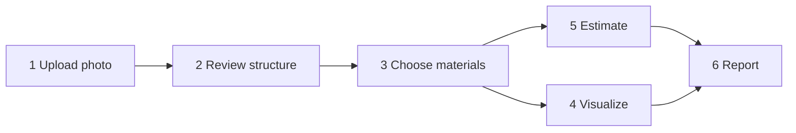

# User workflow

The app is one page per project, laid out as six numbered steps that unlock top-to-bottom. A
homeowner can stop at any point; everything is saved and the project can be reopened later.

## 0. Sign in / projects
Register with email + password. The projects page lists your projects with their current status
(`created → uploaded → segmented → regions_reviewed → rendered / estimated`).

## 1. House photo
Drop or choose a JPEG/PNG/WebP up to 10 MB — ideally the full front elevation, shot in daylight,
camera roughly level. The server checks sharpness, brightness, contrast and size; an unusable
photo is rejected with concrete guidance ("move closer / shoot in daylight / hold the phone
steady"). Borderline photos are accepted with a warning. Replacing the photo later asks for
confirmation because detected regions belong to the old photo.

## 2. Structure
Click **Detect structure**. After a few seconds the photo is overlaid with coloured regions:
walls, windows, doors, balconies, pillars, parapet, roof edge (and railings/gates when a vision
refinement key is configured). Each region shows its source and confidence.

Review and correct: click a region to select it, drag vertices, change its label or name, draw a
new box for anything missed, delete false positives, hide regions you do not want to renovate.
**Save regions** stores your version; user edits are never overwritten by re-detection.

## 3. Materials & design variants
Every renovatable surface gets a dropdown listing only the materials that apply to that kind of
surface (paints and claddings for walls/pillars/parapet, railings for balconies, etc.). Use
*all walls* to apply one choice everywhere of that type; pick a colour for paints and textures.
The catalog panel shows rate, durability and maintenance for each material.

Create several designs (**New design**, **Duplicate**) to compare options — e.g. *Stone front +
paint sides* vs *Brick all round*. Tabs switch between them; **Set active** marks the one the
report should use.

## 4. Visualize
**Generate redesign** produces the house with the chosen materials applied to your actual photo.
Drag the slider to compare before/after, or switch to side-by-side. Every render is kept; a
dropdown lets you go back to earlier ones. Structure (windows, doors, roof line) is preserved by
construction.

## 5. Estimate
The estimate table lists, per surface: area or running length, quantity to buy (litres, boxes of
tiles, sheets, running feet + posts), material cost, labour cost, total; then category subtotals
and a grand total. Below it, the *derivation* table shows how each area was measured and which
assumptions were used (scale reference, foreshortening, openings subtracted).

Two ways to improve accuracy:
- enter the **facade width / height** if you know it (or the number of floors);
- edit any **material or labour rate** to match local quotes, then **Apply rates & recalculate**.

When regions, rates, materials or the photo change after an estimate, a banner says the estimate
is out of date and the report button refuses until you recalculate.

## 6. Report
**Generate report** builds a PDF with the original and redesigned photo, the material list,
quantity derivation, cost breakdown and the assumptions — the document to discuss with a
contractor. Download links expire after 15 minutes; regenerate for a fresh one.

## Re-editing
Any step can be revisited. Editing regions or the photo keeps your material choices for regions
that still exist; anything downstream is marked stale rather than silently reused.
